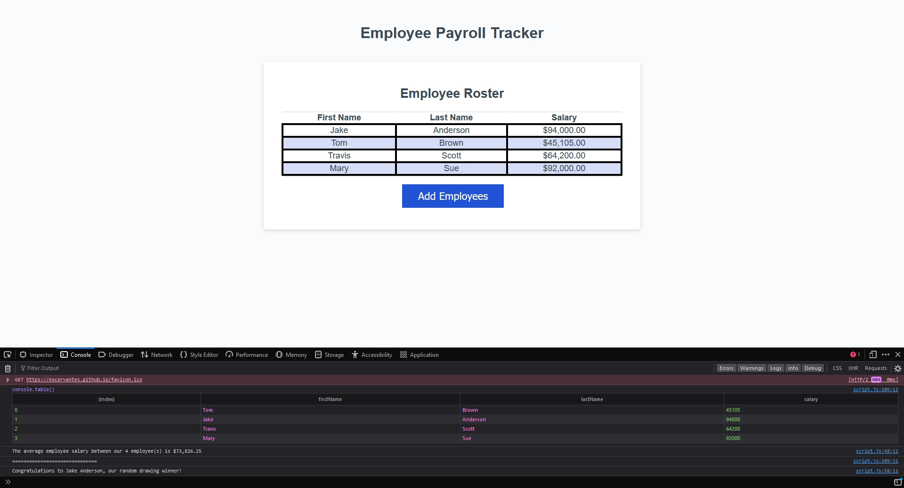

# Employee Payroll Tracker

## Description
This is a web application for tracking the names of employees and their salaries which receives user input and stores them in a table for ease of access. The was a fun project will allowed me to practice working with functions and even creating some higher order functions. I was also able to work with using arrays and objects more and using them in functions. In addition, I learned how to use several new methods of performing code I have done previously with other ways.

An example of what I did in this project is I created a function for taking in the values a user inputs in the "First Name", "Last Name", and "Salary" and returning those values into an object. In this function I implemented several checks for accidental user inputs or clicking cancel for the wrong values in the given prompt. Such as for both the first and last name values if the "Cancel" button is clicked without entering any value then a placeholder of "Unknown" will populate that value's entry instead. Another possible issue addressed was inputting a non number value under "Salary". For this `parseFloat` was used for the salary value which if it returns as "Not a Number" then the (`isNaN`) function is used after which the value is assigned "0".

Next after collecting the values individually I created a `while` loop to store those values into an array named `"employees"`. An `if` statement evaluates the whether the user enters any more information in the fields and if not then a `break` executes to stop the array from collecting values and then returns `"employees"`.

For this next part of the code I was familiar with a couple of methods for determining the average of data such in the following:

```javascript
const displayAverageSalary = (employeesArray) => {
  let initialValue = 0;

  for (let i = 0; i < employeesArray.length; i++) {
    initialValue += employeesArray[i].salary;
  };

  const average = initialValue / employeesArray.length

  console.log(`The average employee salary between our ${employeesArray.length} employee(s) is ${average.toLocaleString("en-US", {
    style: "currency",
    currency: "USD"
  })} `);
}
```
The method above was most familiar to me, however during my research for other methods I discovered a preferred method for performing the same task used more commonly in the coding world. So I decided to experiment with this method to get familiar with it in case I should see it in the future. In the `"script.js"` file you can find the average of the salaries being calculated via `.reduce`. The code is broken out further to make it easier to understand what I was doing with this new method for determining the average of an array. This was fun to learn and work it. I plan on using this more in the future. A messaged is logged to the console displaying the number of entered employees and average salary among them with properties assigned to that value to ensure it is displayed as a proper value in USD.

Lastly, there is function for taking all the collected data inputted from the user and randomly selecting a winner. This was an exercise I was familiar with from my previous studies outside of class working with `Math.floor` for rounding down decimal numbers and `Math.random` multiplying the `"employeesArray"` length to generate a randomly selected name among the user's entered values. Then a message is logged to the console to state the winner's first and last name.


[Link to deployed application.](https://excervantes.github.io/employee-payroll-tracker/)

## Installation

N/A

## Usage

Click on the "Add Employess" blue button for a prompt to appear at the top of the page. There it will ask for a "First Name", then "Last Name", then the salary of the person. If a user does not enter anything in the lines corresponding to the name then the application will insert a placeholder named, "Unknown" for the name field. In addition, the application will take a mistakenly inputted value in the salary that is not a number and display it as "$0" automatically. 

Once all necessary values are inputted click "Cancel" on the "Add Another Employee" prompt. A table will populate containing the names and salaries entered under the "Employee Roster" table.

If a user opens the console in the page additional information can be found logged there. For example an array of the inputted values will be indexed and shown in a table. The console will also log the average salaries between all values entered under "Salary". Lastly, a random winner will be chosen among the names entered on the page.

### Example of Webpage


## Credits

_ecmascript 6 - Average with the Reduce Method in Javascript - Stack Overflow_. (2018, September 2). Stack Overflow. Retrieved April 13, 2024, from https://stackoverflow.com/questions/52139703/average-with-the-reduce-method-in-javascript

## License

GNU GENERAL PUBLIC LICENSE
Version 3, 29 June 2007

See LICENSE for more info
